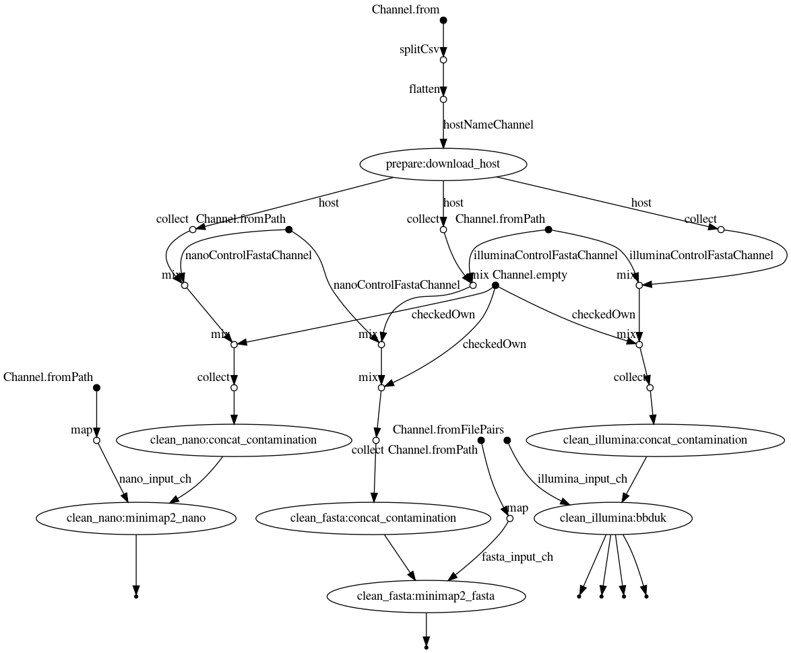

# Clean your data!

A decontamination workflow for short reads, long reads and assemblies.


Email: hoelzer.martin@gmail.com

## Objective

Sequencing data is often contaminated with DNA or RNA from other species. These, normally unwanted, material occurs for biological reasons or can be also spiked in as a control. For example, this is often the case for Illumina data ([phiX phage](https://environmentalmicrobiome.biomedcentral.com/articles/10.1186/1944-3277-10-18)) or Oxford Nanopore
Technologies ([DNA CS (DCS)](https://assets.ctfassets.net/hkzaxo8a05x5/2IX56YmF5ug0kAQYoAg2Uk/159523e326b1b791e3b842c4791420a6/DNA_CS.txt), [yeast ENO2](https://www.yeastgenome.org/locus/S000001217)). Most tools don't take care of such contaminations and thus we can find them in sequence collections and asssemblies ([Mukherjee _et al_. (2015)](https://environmentalmicrobiome.biomedcentral.com/articles/10.1186/1944-3277-10-18)).

## What this workflow does for you

With this workflow you can screen and clean your Illumina, Nanopore or any FASTA-formated sequence date. The results are the clean sequences and the sequences identified as contaminated.
Per default [minimap2](https://github.com/lh3/minimap2) is used for aligning your sequences to reference sequences but I recommend using `bbduk`, part of [BBTools](https://github.com/BioInfoTools/BBMap), to clean short-read data (_--bbduk_).

You can simply specify provided hosts and controls for the cleanup or use your own FASTA files.

## How does it work?

### Installation

* runs with the workflow manager `nextflow` using `docker` or `conda`
* this means all programs are automatically pulled via `docker` or `conda`
* only `docker` or `conda` and `nextflow` need to be installed (per default `docker` is used)

#### Nextflow

Needed in both cases (`conda`, `docker`)

```bash
sudo apt-get update
sudo apt install -y default-jre
curl -s https://get.nextflow.io | bash 
sudo mv nextflow /bin/
```

#### Using Conda

Just copy the commands and follow the installation instructions. Let the installer configure `conda` for you. You need to specify `-profile conde` to run the pipeline with conda support.  

```bash
cd
wget https://repo.anaconda.com/miniconda/Miniconda3-latest-Linux-x86_64.sh
bash Miniconda3-latest-Linux-x86_64.sh
```

See [here](https://docs.conda.io/en/latest/miniconda.html) if you need a different installer besides Linux used above. 

#### Using Docker

##### Easy

If you don't have experience with bioinformatic tools just copy the commands into your terminal to set everything up:

```bash
sudo apt-get install -y docker-ce docker-ce-cli containerd.io
sudo usermod -a -G docker $USER
```

* restart your computer
* try out the installation by entering the following

##### Experienced

###### Dependencies

>   * docker (add docker to your Usergroup, so no sudo is needed)
>   * nextflow + java runtime
>   * git (should be already installed)
>   * wget (should be already installed)
>   * tar (should be already installed)

* Docker installation [here](https://docs.docker.com/v17.09/engine/installation/linux/docker-ce/ubuntu/#install-docker-ce)
* Nextflow installation [here](https://www.nextflow.io/)
* move or add the nextflow executable to a bin path
* add docker to your User group via `sudo usermod -a -G docker $USER`

## Execution examples

Get or update the workflow:

```bash
nextflow pull hoelzer/clean
```

Get help:

```bash
nextflow run hoelzer/clean --help
```

Clean Nanopore data by filtering against a combined reference of the _E. coli_ genome and the Nanopore DNA CS spike-in.  

```bash
# uses Docker per default
nextflow run hoelzer/clean --nano ~/.nextflow/assets/hoelzer/clean/test/nanopore.fastq.gz \
--host eco --control dcs

# use conda instead of Docker
nextflow run hoelzer/clean --nano ~/.nextflow/assets/hoelzer/clean/test/nanopore.fastq.gz \
--host eco --control dcs -profile conda
```

Clean Illumina paired-end data against your own reference FASTA using bbduk instead of minimap2.

```bash
# enter your home dir!
nextflow run hoelzer/clean --illumina '/home/martin/.nextflow/assets/hoelzer/clean/test/illumina*.R{1,2}.fastq.gz' \
--own ~/.nextflow/assets/hoelzer/clean/test/ref.fasta.gz --bbduk
```

Clean some Illumina, Nanopore, and assembly files against the mouse and phiX genomes.  

```bash
# enter your home dir!
nextflow run hoelzer/clean --illumina '/home/martin/.nextflow/assets/hoelzer/clean/test/illumina*.R{1,2}.fastq.gz' \
--nano ~/.nextflow/assets/hoelzer/clean/test/nanopore.fastq.gz \
--fasta ~/.nextflow/assets/hoelzer/clean/test/assembly.fasta \
--host mmu --control phix
```

## Supported species and control sequences

Currently supported are:

|flag | species | source|
|-----|---------|-------|
|hsa  | _Homo sapiens_       | [Ensembl: Homo_sapiens.GRCh38.dna.primary_assembly] |
|mmu  | _Mus musculus_       | [Ensembl: Mus_musculus.GRCm38.dna.primary_assembly] |
|csa  | _Chlorocebus sabeus_ | [NCBI: GCF_000409795.2_Chlorocebus_sabeus_1.1_genomic] |
|gga  | _Gallus gallus_      | [NCBI: Gallus_gallus.GRCg6a.dna.toplevel] |
|cli  | _Columba livia_      | [NCBI: GCF_000337935.1_Cliv_1.0_genomic] |
|eco  | _Escherichia coli_   | [Ensembl: Escherichia_coli_k_12.ASM80076v1.dna.toplevel] |

Included in this repository are:

|flag | control/spike | source |
|-----|---------|-------|
| dcs |3.6 kb standard amplicon mapping the 3' end of the Lambda genome| https://assets.ctfassets.net/hkzaxo8a05x5/2IX56YmF5ug0kAQYoAg2Uk/159523e326b1b791e3b842c4791420a6/DNA_CS.txt |
| eno |yeast ENO2 Enolase II of strain S288C, YHR174W| https://raw.githubusercontent.com/hoelzer/clean/master/controls/S288C_YHR174W_ENO2_coding.fsa |
| phix|enterobacteria_phage_phix174_sensu_lato_uid14015, NC_001422| ftp://ftp.ncbi.nlm.nih.gov/genomes/Viruses/enterobacteria_phage_phix174_sensu_lato_uid14015/NC_001422.fna |

... for reasons. More can be easily added! Just write me, add an issue or make a pull request.

## Flowchart


