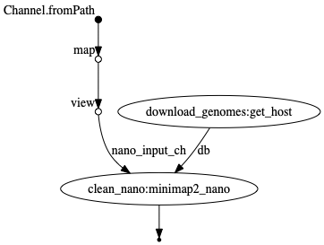

# Workflow template


Maintainer: Martin

Email: hoelzer.martin@gmail.com


# Input examples

* **one** .fastq file per sample: `--nano 'sample1.fastq'`
* paired end illumina: `--illumina 'S_41_17_Cf*.R{1,2}.fastq.gz'`
* **one** .fasta file per sample: `--fasta 'sample1.fasta'`

# Execution example

````
nextflow run main.nf
````

# Flowchart
