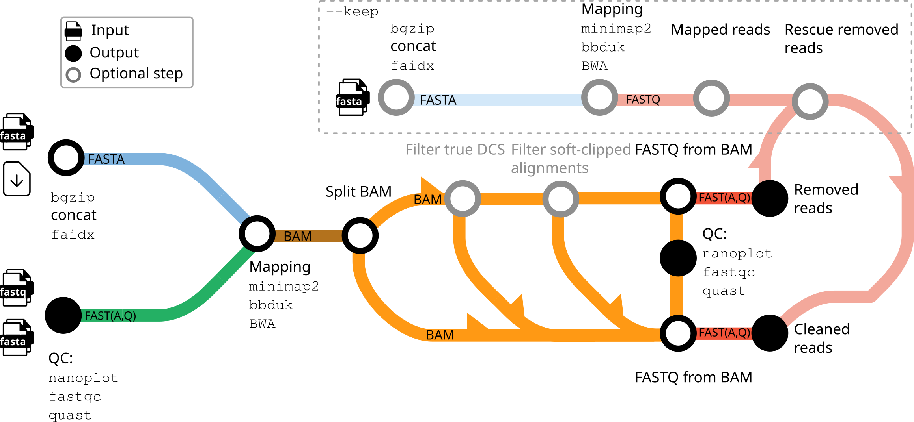

# Clean your data!

A reference-based decontamination workflow for short reads, long reads, and assemblies.


Email: hoelzerm@rki.de, lataretum@rki.de

## Objective

Sequencing data is often contaminated with DNA or RNA from other species. These, normally unwanted, material occurs for biological reasons or can be also spiked in as a control. For example, this is often the case for Illumina data ([phiX phage](https://environmentalmicrobiome.biomedcentral.com/articles/10.1186/1944-3277-10-18)) or Oxford Nanopore
Technologies ([DNA CS (DCS)](https://assets.ctfassets.net/hkzaxo8a05x5/2IX56YmF5ug0kAQYoAg2Uk/159523e326b1b791e3b842c4791420a6/DNA_CS.txt), [yeast ENO2](https://www.yeastgenome.org/locus/S000001217)). Most tools don't take care of such contaminations and thus we can find them in sequence collections and asssemblies ([Mukherjee _et al_. (2015)](https://environmentalmicrobiome.biomedcentral.com/articles/10.1186/1944-3277-10-18)).

## What this workflow does for you

With this workflow you can screen and clean your Illumina, Nanopore or any FASTA-formated sequence data. The results are the clean sequences and the sequences identified as contaminated. Per default [minimap2](https://github.com/lh3/minimap2) is used for aligning your sequences to reference sequences (with the `map-ont` settings for Nanopore data and `sr` settings for short-read data activated automatically). However, for short-read data, you may want to switch to [BWA](https://github.com/lh3/bwa) (`--bwa`). As another alternative, we provide `bbduk`, part of [BBTools](https://github.com/BioInfoTools/BBMap), as a kmer-based approach (`--bbduk`). However, no mapping file will be produced with `bbduk` and thus some subsequent statistics are not calculated. 

You can simply specify provided hosts and controls for the cleanup or use your own FASTA files. The reads are then mapped (or kmer-based compared in case of `bbduk`) against the specified host, control, and user defined FASTA files. All reads that match are considered as contamination. In case of Illumina paired-end reads, both mates need to be aligned (singleton files will be produced otherwise).

The read input is defined via `--input_type nano` for Nanopore and `--input_type illumina` or `--input_type illumina_single_end` for Illumina reads. Additional control(s) for decontamination can be defined via `--control`. If controls are defined, they are selectively concatenated with the host and potential own FASTA files for decontamination. We provide auto-download for the following controls: `dcs` for Nanopore DNA-Seq, `eno` for Nanopore RNA-Seq, and `phix` from Illumina data. In general, specified host, control, and user defined FASTA files are concatenated for decontamination.

### Filter soft-clipped contamination reads

We saw many soft-clipped reads after the mapping, that probably aren't contamination. With `--min_clip` the user can set a threshold for the number of soft-clipped positions (sum of both ends). If `--min_clip` is greater 1, the total number is considered, else the fraction of soft-clipped positions to the read length. The output consists of all mapped, soft-clipped, and mapped reads passing the filer.

## Requirements

### Workflow management

- [Nextflow](https://www.nextflow.io/docs/latest/getstarted.html#installation)

### Dependencies management

For dependency handling you have to use one of the following technologies:

- [Conda](https://docs.conda.io/en/latest/miniconda.html)
- [Mamba](https://mamba.readthedocs.io/en/latest/installation/micromamba-installation.html)
- [Docker](https://docs.docker.com/get-docker/)
- [Singularity](https://docs.sylabs.io/guides/3.0/user-guide/installation.html)

As default `docker` is used; to switch to another technology for dependency handling, e.g., `mamba`, use `-profile mamba`.

### Run engine

Per default we assume you are running the tool on a laptop or work station (`local`). You can change the pipeline behaviour for example when running on a HPC with the SLURM workload manager via `-profile slurm`.

Dependencies and run engines can be combined, e.g., to run with Singularity on LSF use `-profile singularity,lsf`.

## Execution examples

Get or update the workflow:

```bash
nextflow pull rki-mf1/clean
```

Get help:

```bash
nextflow run rki-mf1/clean --help
```

We always recommend running a release version. **Check for latest releases!** In these examples we use release `-r v1.1.0`:

```bash
# check available release versions and branches
nextflow info rki-mf1/clean
# select a release and run it to show the help
nextflow run rki-mf1/clean -r v1.1.0 --help
```

Clean Nanopore data by filtering against a combined reference of the _E. coli_ genome and the Nanopore DNA CS spike-in.

```bash
# uses Docker per default
nextflow run rki-mf1/clean -r v1.1.0 --input_type nano --input ~/.nextflow/assets/rki-mf1/clean/test/nanopore.fastq.gz \
--host eco --control dcs

# use mamba instead of Docker
nextflow run rki-mf1/clean -r v1.1.0 --input_type nano --input ~/.nextflow/assets/rki-mf1/clean/test/nanopore.fastq.gz \
--host eco --control dcs -profile mamba
```

Clean Illumina paired-end data against your own reference FASTA using `bbduk` instead of `minimap2`.

```bash
# we have to define the $HOME specifically here, not sure why
nextflow run rki-mf1/clean -r v1.1.0 --input_type illumina --input $HOME/'.nextflow/assets/rki-mf1/clean/test/illumina*.R{1,2}.fastq.gz' \
--own ~/.nextflow/assets/rki-mf1/clean/test/ref.fasta.gz --bbduk
```

## Supported species and control sequences

Currently supported are:

|flag | species | source|
|-----|---------|-------|
|hsa  | _Homo sapiens_       | [Ensembl: Homo_sapiens.GRCh38.dna.primary_assembly, incl. mtDNA] |
|t2t  | _Homo sapiens_       | [[T2T Consortium](https://sites.google.com/ucsc.edu/t2tworkinggroup/): T2T-CHM13v2.0 (T2T-CHM13+Y, file name: GCA_009914755.4_T2T-CHM13v2.0_genomic), datasets released along the v2.0 (T2T-CHM13) and the T2T-Y chromosome, see [paper](https://www.nature.com/articles/s41586-023-06457-y), incl. mtDNA] |
|mmu  | _Mus musculus_       | [Ensembl: Mus_musculus.GRCm38.dna.primary_assembly, incl. mtDNA] |
|csa  | _Chlorocebus sabeus_ | [NCBI: GCF_000409795.2_Chlorocebus_sabeus_1.1_genomic, incl. mtDNA] |
|gga  | _Gallus gallus_      | [NCBI: Gallus_gallus.GRCg6a.dna.toplevel, incl. mtDNA] |
|cli  | _Columba livia_      | [NCBI: GCF_000337935.1_Cliv_1.0_genomic, incl. mtDNA] |
|eco  | _Escherichia coli_   | [Ensembl: Escherichia_coli_k_12.ASM80076v1.dna.toplevel] |
|sc2  | _SARS-CoV-2_         | [ENA Sequence: MN908947.3 (Wuhan-Hu-1 complete genome) [web](https://www.ebi.ac.uk/ena/browser/view/MN908947.3) [fasta](https://www.ebi.ac.uk/ena/browser/api/fasta/MN908947.3?download=true)] |

Controls included in this repository are:

|flag | recommended usage | control/spike | source |
|-----|-|---------|-------|
| dcs | ONT DNA-Seq reads |3.6 kb standard amplicon mapping the 3' end of the Lambda genome| https://assets.ctfassets.net/hkzaxo8a05x5/2IX56YmF5ug0kAQYoAg2Uk/159523e326b1b791e3b842c4791420a6/DNA_CS.txt |
| eno | ONT RNA-Seq reads |yeast ENO2 Enolase II of strain S288C, YHR174W| https://raw.githubusercontent.com/rki-mf1/clean/master/controls/S288C_YHR174W_ENO2_coding.fsa |
| phix| Illumina reads |enterobacteria_phage_phix174_sensu_lato_uid14015, NC_001422| ftp://ftp.ncbi.nlm.nih.gov/genomes/Viruses/enterobacteria_phage_phix174_sensu_lato_uid14015/NC_001422.fna |

... for reasons. More can be easily added! Just write us, add an issue, or make a pull request.

## Workflow



<sub><sub>The icons and diagram components that make up the schematic view were originally designed by James A. Fellow Yates & nf-core under a CCO license (public domain).</sub></sub>

## Results

Running the pipeline will create a directory called `results/` (can be changed via `--output`) in the current directory with some or all of the following directories and files (plus additional files for indices, ...):

```text
results/
├── clean/
│   └── <sample_name>.fastq.gz
├── removed/
│   └── <sample_name>.fastq.gz
├── intermediate/
│   ├── map-to-remove/
│   │   ├── <sample_name>.mapped.fastq.gz
│   │   ├── <sample_name>.unmapped.fastq.gz
│   │   ├── <sample_name>.sorted.bam
│   │   ├── <sample_name>.sorted.bam.bai
│   │   ├── <sample_name>.sorted.flagstat.txt
│   │   ├── <sample_name>.sorted.idxstats.tsv
│   │   ├── strict-dcs/
│   │   │   ├── <sample_name>.no-dcs.bam
│   │   │   ├── <sample_name>.true-dcs.bam
│   │   │   └── <sample_name>.false-dcs.bam
│   │   └── soft-clipped/
│   │       ├── <sample_name>.soft-clipped.bam
│   │       └── <sample_name>.passed-clipped.bam
│   ├── map-to-keep/
│   │   ├── <sample_name>.mapped.fastq.gz
│   │   ├── <sample_name>.unmapped.fastq.gz
│   │   ├── <sample_name>.sorted.bam
│   │   ├── <sample_name>.sorted.bam.bai
│   │   ├── <sample_name>.sorted.flagstat.txt
│   │   ├── <sample_name>.sorted.idxstats.tsv
│   │   ├── strict-dcs/
│   │   │   ├── <sample_name>.no-dcs.bam
│   │   │   ├── <sample_name>.true-dcs.bam
│   │   │   └── <sample_name>.false-dcs.bam
│   │   └── soft-clipped/
│   │       ├── <sample_name>.soft-clipped.bam
│   │       └── <sample_name>.passed-clipped.bam
|   ├── host.fa.fai
|   └── host.fa.gz
├── logs/*.html
└── qc/multiqc_report.html
```

The most important files you are likely interested in are `results/clean/<sample_name>.fastq.gz`, which are the "cleaned" reads. These are the input reads that *do not* map to the host, control, own fasta or rRNA files (or the subset of these that you provided), plus those reads that map to the "keep" sequence if you used the `--keep` option. Any files that were removed from your input fasta file are placed in `results/removed/<sample_name>.fastq.gz`.

For debugging purposes we also provide various intermediate results in the `intermediate/` folder. For mapping-based approaches (`minimap2`, `bwa`), you will also find a brief summary of mapped/unmapped reads and their proportions. 

## Acknowledgements

- Thanks to Matt Huska (@matthuska) for extensive testing of `CLEAN`, bug fixing, and reorganizing the output. 
- Thanks to XXX for valuable feedback and a pull request adding a simple summary table for mapping-based approaches.

## Citations

If you use `CLEAN` in your work, please consider citing our preprint:

> Targeted decontamination of sequencing data with CLEAN
> Marie Lataretu, Sebastian Krautwurst, Adrian Viehweger, Christian Brandt, Martin Hölzer
> bioRxiv 2023.08.05.552089; doi: https://doi.org/10.1101/2023.08.05.552089

Additionally, an extensive list of references for the tools used by the pipeline can be found in the [`CITATIONS.md`](CITATIONS.md) file. **Please consider also citing these tools because w/o them there would be no CLEAN!**
